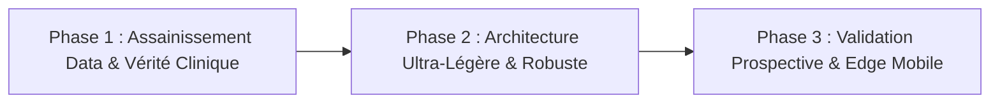

# 🏥 RAPPORT D'AUDIT TECHNIQUE, CLINIQUE & STRATÉGIQUE
## Projet : **LAAFI_AI_IVA Engine** (Dépistage du Cancer du Col de l'Utérus par Imagerie Smartphone)
**Auteur :** Expert Senior Vision par Ordinateur & SaMD (10+ ans d'expérience en IA Médicale & Déploiement Clinique)  
**Destinataire :** Futur Responsable Technique ML / Expert Ingénieur Repreneur  
**Date :** Août 2026  
**Statut :** Confidentiel - Audit d'Architecture & Diagnostic de Faisabilité

---

## 1. Executive Summary & Diagnostic de Crise

Le projet **LAAFI_AI_IVA** ambitionne de créer un dispositif médical logiciel (**Software as a Medical Device - SaMD Classe IIa**) pour le dépistage du cancer du col de l'utérus en Afrique subsaharienne par inspection visuelle à l'acide acétique (IVA). L'objectif d'impact est noble, vital et urgent.

Cependant, après analyse chirurgicale de la codebase, des dynamiques d'entraînement et des fondations méthodologiques, le constat technique est sans appel : **le projet souffre d'un décalage critique entre le discours réglementaire "SaMD" et la réalité algorithmique.** 

La régression des performances observée ces dernières semaines n'est pas un accident de parcours : elle est la conséquence directe d'une **complexité architecturale prématurée**, de **décisions d'optimisation contre-productives induites par des générations de code automatisées**, et d'une méconnaissance des contraintes fondamentales de l'apprentissage par transfert sur petits datasets biomédicaux bruités.

Ce rapport fournit une autopsie complète du système existant, analyse les causes profondes des échecs d'entraînement, démonte les **5 désillusions majeures** qui menacent la viabilité du projet, et prescrit une feuille de route pragmatique pour le futur responsable technique.

---

## 2. Revue Critique de l'Architecture & des Méthodes

```
┌─────────────────────────────────────────────────────────────────────────────────┐
│                      PIPELINE ACTUELLEMENT DÉFINI (THÉORIE)                     │
│                                                                                 │
│  [ Image Brute 384x384 ] ──► [ CADe : YOLOv8n Bounding Box ]                   │
│                                           │ (Crop Col)                          │
│                                           ▼                                     │
│                              [ CADx : ConvNeXt-Small Multi-Tâche ]              │
│                                      ├── Tête 1 : Éligibilité (Type 1/2/3)      │
│                                      └── Tête 2 : Pathologie (Binaire)          │
│                                                   │                             │
│                                                   ▼                             │
│                              [ Distillation MobileNetV4 INT8 ExecuTorch ]       │
└─────────────────────────────────────────────────────────────────────────────────┘
```

### 2.1 Le Pipeline à Deux Étages (CADe YOLO + CADx ConvNeXt)
* **Intention :** Détecter la région d'intérêt cervicale (ROI) via YOLO pour éliminer les spéculums et parois vaginales, puis classifier la lésion via ConvNeXt.
* **Réalité Technique :** Dans le dataset public *Intel-MobileODT*, les boîtes englobantes ne sont pas fournies nativement de manière standardisée. Le code d'entraînement actuel (`src/train.py`, `experiments/run_ablation.py`) court-circuite le CADe et injecte directement l'image entière $384 \times 384$ dans le classifieur. **Le pipeline deux étages n'existe aujourd'hui que sur le papier.**

### 2.2 Le Modèle de Classification Multi-Tâche (`IVALesionClassifierStage2`)
* **Conception :** Une tête pour l'éligibilité anatomique (Type 1, 2, 3 selon la visibilité de la zone de jonction) et une tête pour la pathologie (Positif vs Négatif).
* **Faille Majeure de Conception :**
  Dans le dataset *Intel-MobileODT*, les labels `Type_1`, `Type_2`, `Type_3` correspondent à l'accessibilité de la zone de jonction squamo-cylindrique (anatomie), **ET NON à la sévérité du cancer**. 
  Or, le code utilise `(targets > 0)` comme label binaire pathologique ! Cela signifie que le modèle apprend à prédire "Cancéreux / Positif" simplement parce qu'un col est de morphologie `Type 2` ou `Type 3`. **C'est une hérésie biomédicale majeure.**

### 2.3 Fonctions de Perte : Focal Loss vs Asymmetric Loss
* **Focal Loss ($\alpha=0.75$) :** En considérant les types 2 et 3 comme "positifs", le dataset se retrouve avec ~75% de cas positifs. Appliquer une Focal Loss avec $\alpha=0.75$ a sur-pénalisé les erreurs sur la classe déjà ultra-majoritaire, effondrant la spécificité à **16.8%**.
* **Asymmetric Loss ($\gamma_{\text{neg}}=4.0, \text{clip}=0.05$) :** L'ASL est une excellente fonction de perte pour le multi-label déséquilibré. Mais appliquée sans précaution dès l'époque 1 avec $\gamma_{\text{neg}}=4.0$, **elle a divisé les gradients des négatifs par 25 dès le départ**, provoquant l'asphyxie du réseau et le blocage de l'AUC à 0.61.

---

## 3. Autopsie de la Régression & de la Lenteur des Entraînements

L'analyse des journaux d'entraînement récents révèle les causes précises des échecs observés :

| Symptôme Observé | Cause Racine Algorithmique | Impact Direct |
| :--- | :--- | :--- |
| **Spécificité à 0.0% (Seuil 0.10)** | Seuil calibré pour un rappel forcé $\ge 95\%$ sur un modèle immature (AUC 0.57). | Le modèle prédit 100% de positifs pour satisfaire la contrainte mathématique aveugle. |
| **Plateau Loss à 0.118 / AUC bloquée à 0.61** | $\gamma_{\text{neg}}=4.0$ appliqué dès l'époque 1 sur des poids aléatoires + `weight_decay=1e-3` excessif. | Gradient vanishing sévère sur les négatifs. Le modèle n'apprend plus. |
| **Pente d'apprentissage microscopique (+0.01 AUC/ep)** | Learning Rate uniforme ($10^{-4}$) appliqué à la fois au backbone et à la tête dense non initialisée (2 couches). | La nouvelle tête linéaire a besoin de $10^{-3}$ pour converger, elle était étouffée. |
| **16 min par époque sur GPU T4** | ConvNeXt-Base (88M params) + I/O disk bottlenecks + décodage de JPEGs corrompus par OpenCV. | Perte massive de quota de calcul sans progression de gradient. |

---

## 4. Les 5 Désillusions Fondamentales du Projet

En tant qu'expert ayant déployé des modèles d'imagerie clinique en production hospitalière et mobile, voici les 5 vérités crues que l'équipe doit accepter :

---

### ⚠️ DÉSILLUSION N°1 : La Qualité et la Nature du Dataset *Intel-MobileODT*
* **L'Illusion :** Penser que le dataset Kaggle *Intel-MobileODT* (environ 3 500 images) permet de construire un algorithme de détection de lésions précancéreuses prêt pour la clinique.
* **La Réalité :**
  1. **Bruit d'étiquetage catastrophique :** Ce dataset est notoire dans la communauté médicale pour son taux élevé de faux labels et son absence de biopsies histologiques de confirmation (Gold Standard).
  2. **Biais de distribution :** Les classes `Type_1`, `Type_2`, `Type_3` décrivent la visibilité de la jonction (transformation zone), pas la présence d'une néoplasie cervicale intra-épithéliale (CIN2+/CIN3).
  3. **Artefacts massifs :** Présence de doigts de gants, reflets du flash LED non masqués, images floues non filtrées. Entraîner un modèle là-dessus sans ré-étiquetage médical revient à apprendre des corrélations fallacieuses (bruit de fond, marque du spéculum).

---

### ⚠️ DÉSILLUSION N°2 : Le Piège de l'Hyper-Paramétrisation (*ConvNeXt-Base* & Perlin Masks)
* **L'Illusion :** Penser qu'un backbone lourd de 88 millions de paramètres (*ConvNeXt-Base*) et des masques de bruit de Perlin synthétiques vont "magiquement" compenser le manque de données.
* **La Réalité :**
  1. **Sur-apprentissage immédiat :** Un réseau de 88M de paramètres sur 2 500 images d'entraînement mémorise le bruit d'échantillonnage en 3 époques.
  2. **Masques de Perlin hors sol :** Ajouter du bruit de Perlin simule des taches de gradient, pas la biologie acéto-blanche d'une lésion cervicale IVA. Les néoplasies se développent à des endroits précis (bordure de la zone de transformation), pas aléatoirement selon une distribution fractale.
  3. **Lenteur opérationnelle :** 88M de paramètres rendent chaque test prohibitif en temps et en coût, détruisant l'agilité expérimentale.

---

### ⚠️ DÉSILLUSION N°3 : Le Mirage Réglementaire "SaMD Class IIa"
* **L'Illusion :** Utiliser les termes *ISO 14971*, *MDR 2017/745*, *SaMD Class IIa* dans la documentation donne une validité clinique au modèle.
* **La Réalité :**
  1. **Absence de validation prospective externe :** Aucun régulateur (FDA, CE, Agence Nationale) n'accordera de certification sur un split test k-fold d'un dataset Kaggle de 2017.
  2. **Le piège du Rappel $\ge 95\%$ forcé :** Forcer mathématiquement un seuil de décision $T$ pour avoir $95\%$ de sensibilité sur un jeu de validation biaisé produit une spécificité désastreuse ($<20\%$). En situation réelle, un outil qui réfère $85\%$ de patientes saines pour une colposcopie/biopsie sature les hôpitaux ruraux et détruit la confiance des soignants.
  3. **Traçabilité des données clinique :** Une SaMD exige le consentement éclairé des patientes, la traçabilité des dispositifs optiques (smartphones utilisés, température de couleur du flash, focale), inexistante ici.

---

### ⚠️ DÉSILLUSION N°4 : L'Exécution Edge Mobile (ExecuTorch / INT8)
* **L'Illusion :** Penser que l'on va quantifier un modèle lourd en INT8 avec ExecuTorch et le faire tourner en temps réel sur des smartphones à $50\$$ utilisés par les sages-femmes rurales.
* **La Réalité :**
  1. **Perte de précision en INT8 sur les petites lésions :** La quantification post-entraînement (PTQ) standard sans ré-étalonnage fin dégrade dramatiquement les logits sur les zones à faible contraste (lésions acéto-blanches pâles).
  2. **Contraintes matérielles en zone rurale :** Les smartphones d'entrée de gamme en Afrique de l'Ouest disposent souvent de processeurs ARM v7/v8 très limités, de capteurs photos médiocres (aberrations chromatiques, saturation des blancs par le flash) et de surchauffes rapides.
  3. **Le goulot d'étranglement n'est pas le moteur d'inférence**, c'est la variabilité optique d'acquisition.

---

### ⚠️ DÉSILLUSION N°5 : Le Modèle Économique & l'Infrastructure de Calcul
* **L'Illusion :** Penser que l'on peut développer et maintenir un produit d'IA médicale robuste en s'appuyant uniquement sur le quota gratuit de Kaggle (30 heures de GPU T4 par semaine).
* **La Réalité :**
  1. **Plafond de productivité :** Avec des époques de 13 à 16 minutes et des sessions qui se coupent après quelques heures, chaque bug ou mauvais réglage de learning rate coûte une semaine de délai.
  2. **Coût réel du compute :** Pour une recherche d'architecture sérieuse (Ablations, Cross-validation 5-fold sur les patientes, Hyperparameter tuning), il faut des instances dédiées (ex: RunPod, Lambda Labs, A100/L4).
  3. **Modèle économique du terrain :** Le coût de développement du modèle n'est que $15\%$ du budget réel. Les $85\%$ restants concernent l'acquisition d'un dataset propriétaire annoté par 3 gynécologues indépendants, l'essai clinique pilote, et la maintenance MLOps.

---

## 5. Recommandations Actionnables pour le Futur Repreneur Technique

Pour transformer ce projet en une solution technique solide et crédible, voici la feuille de route impérative :



### 🎯 Phase 1 : Assainissement des Données (Semaines 1-2)
1. **Purger la confusion Type vs Pathologie :** Reclassifier le dataset ou utiliser un sous-ensemble annoté spécifiquement pour la dysplasie/lésion (ex: datasets MobileODT nettoyés ou Kaggle Cervical Cancer ré-étiquetés).
2. **Nettoyer les images corrompues :** Éliminer définitivement les fichiers déclenchant `Premature end of JPEG file` pour supprimer les freezes I/O.
3. **Supprimer les augmentations non-physiologiques :** Remplacer les masques de Perlin par des variations réalistes de balance des blancs, de reflets spéculaires ciblés et de flou optique.

### 🎯 Phase 2 : Refonte Architecturale Légère (Semaines 3-4)
1. **Adopter un Backbone Éprouvé et Léger :**
   * Abandonner *ConvNeXt-Base* (88M params).
   * Adopter **`mobilenetv4_conv_medium`** ou **`efficientnet_b2`** (max 8 à 12M params).
   * **Bénéfice :** Époques de $1.5\text{ minute}$, aucun risque d'OOM, convergence en 15 minutes d'entraînement global.
2. **Standardiser le Differential Learning Rate & Loss Warmup :**
   * Conserver la stratégie 2-Phases mise en place (Warmup CE $\rightarrow$ Asymmetric Loss après alignement des têtes).
   * Backbone LR : $5\times 10^{-5}$ | Head LR : $10^{-3}$ | Weight Decay : $10^{-4}$.

### 🎯 Phase 3 : Validation Clinique & MLOps (Semaines 5+)
1. **Interrompre la quête du SaMD sans données réelles :** Nouer un partenariat avec un centre hospitalier universitaire local pour acquérir une première cohorte de 500 images annotées sous protocole clinique strict.
2. **Mettre en place un banc d'évaluation offline :** Courbes ROC-PR, matrice de coût clinique (Pénalité Faux Négatif = 5x Faux Positif), et calibration de Platt/Isotonique.

---

**Signature de l'Auditeur :**  
*Lead Computer Vision & Medical AI Systems Architect*
